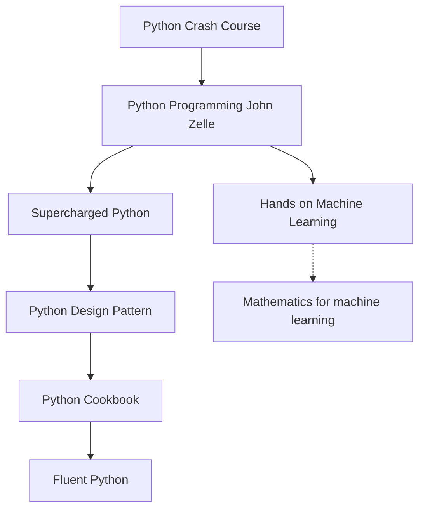

# book_stack

Handy notes from books i've read.

the list is written according to APA citation for better referencing.
`last_name, initial. (year). book_title (edition). publisher`

## Basic

- Downey, A. (2016). _Think Python_ (2nd edition). O'Reilly Media, Inc.

- Matthes, E. (2023). _Python Crash Course: A Hands-On, Project-Based Introduction to Programming_ (3rd edition). No Starch Press.

- Sweigart, A. (2019). _Automate the Boring Stuff with Python: Practical Programming for Total Beginners_ (2nd edition). No Starch Press.

- Overland, B, Bennett J. (2019). _Supercharged Python: Take Your Code to the Next Level_. Pearson Education.

# Advanced

- Zelle, J. (2016). _Python Programming: An Introduction to Computer Science_ (3rd edition). Franklin, Beedle & Associates, Inc.

- Beazley, D, Jones, B. (2013). _Python Cookbook: Recipes for Mastering Python_ (3rd edition). O'Reilly Media, Inc.

- Ramalho, L. (2022). _Fluent Python_ (2nd edition). O'Reilly Media, Inc.

# goin to review and read below

